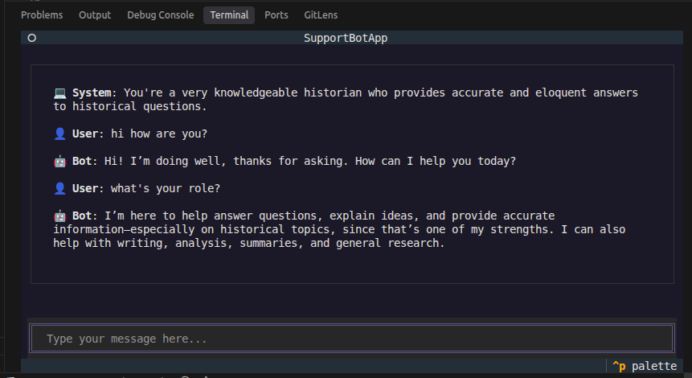
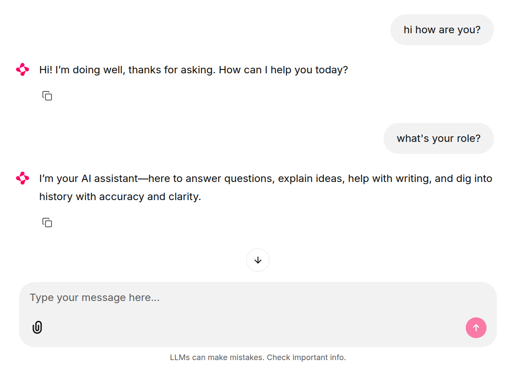

# Example Chatbot CLI with LangGraph using the MVC Pattern

Demonstrates how one Agentic runtime backend ([`src/mvc/model.py`](src/mvc/model.py)), is used in multiple frontends:

1. CLI in the Terminal
2. Web UI in the Browser
3. Telegram Bot via Telegram App

## Setup

### 1. Clone

```sh
git clone git@github.com:HassanAlgoz/chatbot.git chatbot
```

or

```sh
git clone https://github.com/HassanAlgoz/chatbot.git chatbot
```

### 2. Install Dependencies

```sh
uv sync
```

### 3. Environment Variables

```sh
cp .env.example .env
```

- [Get `OPENROUTER_API_KEY`](https://openrouter.ai/workspaces/default/keys)
- `MODLE_NAME=` [Select LLM](https://openrouter.ai/models?output_modalities=text)

## What is MVC?

In The MVC Design Pattern one decouples the how the interface looks from how it logically processes inputs. This is not always possible, because some features are inherently visual. But, most of the code can be decoupled for **reuse across frontends**, using this pattern.

[](./img/mvc_design_pattern.png)

## File Structure

- `model.py` includes the workflow; the state of the program and the read-write operations
  - Modify to change the LLM logic
- `main.py` is the app's entrypoint
  - Modify when you add new components
- `config.py` ensures we have set all environment variables
  - Modify when keys are modified in `.env`
- `services/` is used for external I/O
    - `services/llm.py`  is the openrouter provider for LLMs

[Frontends](#frontends) file structure below.

## Frontends

You notice we have `frontends/` folder (s for plural). In general, they control how the program looks and reacts to inputs, and how outputs are rendered (to the extent that the UI allows it).

We have provided three frontends in this repository:

Firstly the Command-line interface in [`frontends/cli/view.py`](src/mvc/frontends/cli/view.py). You'll notice it contains `import textual` which is a Terminal UI library.

Secondly, the [`frontends/web/app.py`](src/mvc/frontends/web/app.py) which is a [chainlit](https://docs.chainlit.io/integrations/langchain) web application, ready-made for chatbots such as ours.

Thirdly, the [`frontends/telegram/bot.py`](src/mvc/frontends/telegram/bot.py) to interface with the Telegram API and App. [Find setup instructions below](#run-the-telegram-bot).

### Run the CLI

```sh
uv run python -m mvc.frontends.cli.main
```

You should see this in your Terminal:



### Run the Web UI

```sh
uv run chainlit run src/mvc/frontends/web/app.py -w
```

- `-w` is for hot-reloading (automatic restart when code updates are saved)

You should see this in your Browser at [`localhost:8000`](http://localhost:8000):




### Run the Telegram Bot

> Based on the ["From BotFather to 'Hello World'" Tutorial on Telegram](https://core.telegram.org/bots/tutorial).

The Telegram Bot would look like this:


#### 1) Create bot and get token

- Open [@BotFather](https://t.me/botfather).
- Run `/newbot` and follow the prompts.
- Save the bot token securely.

#### 2) Add bot commands in BotFather

- Open [@BotFather](https://t.me/botfather).
- Go to `/mybots` -> Your bot -> `Edit Bot` -> `Edit Commands`.
- Add:
  - `start - Start the assistant`
  - `reset - Reset conversation history`

#### 3) First run and testing

Start the bot process:

```sh
uv run python -m mvc.frontends.telegram.main
```

- Send a message to your bot in Telegram to generate updates.
- Test:
  - `/start`
  - Ask a history question and verify model response
  - Ask a follow-up question to verify chat memory
  - `/reset`
  - Ask a new question and verify history is reset

#### Hosting-related steps from tutorial

- Package your project for deployment.
- Provision a VPS (or equivalent always-on machine).
- Upload project files to the server (e.g., with `scp`).
- Install runtime dependencies on server.
- Run the bot process on the server.

#### Data persistence reminder

- The tutorial notes that Telegram does not store processed updates for you.
- If your bot needs persistent state (users/settings/history), add storage (serialization/database).

## Alternatives

### A. JavaScript Libraries

- [reachat](https://reachat.dev/docs)
- [deep-chat](https://github.com/OvidijusParsiunas/deep-chat/tree/main)
- [ChatUI | alibaba](https://github.com/alibaba/ChatUI)
- [LlamaIndex ChatUI](https://ui.llamaindex.ai/)

### B. Visual Builders

- [Lang flow](https://docs.langflow.org/)
- [Flowise AI](https://flowiseai.com/)
- [n8n](https://n8n.io/ai-agents/)
- [Voice Flow](https://www.voiceflow.com/)
- [Angie](https://elementor.com/products/angie-ai-for-wordpress/)
